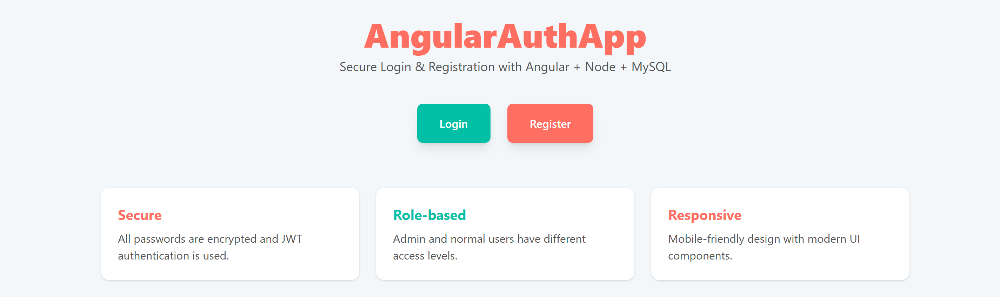
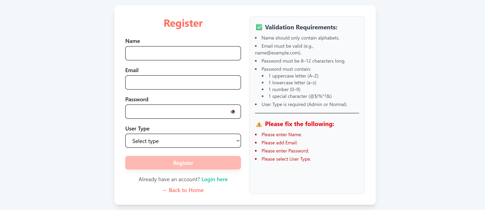
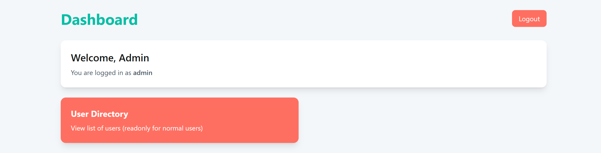
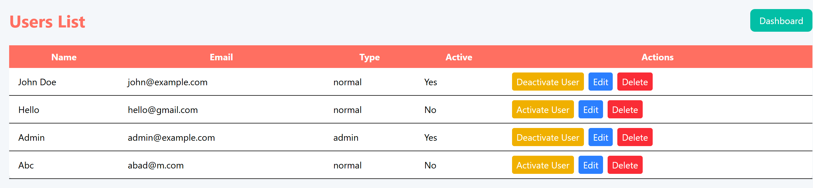

# Angular Login & Registration

This is a full-stack web application built with Angular and Node.js, with MySQL as the database. It supports user registration, login, and dashboard management.

## Features
- User registration and login with validations
- Password requirements: 8–12 characters, uppercase, lowercase, number, special symbol
- Protected routes using Angular Auth Guard
- Dashboard accessible only to authenticated users
- Responsive UI with Tailwind CSS

## Technologies Used
- Frontend: Angular 17, Tailwind CSS
- Backend: Node.js, Express.js
- Database: MySQL
- Tools: Nodemon, dotenv
- Version Control: Git

## Screenshots

### Home Page

### Login Page

### Register Page

### Dashboard Page

### User Page

